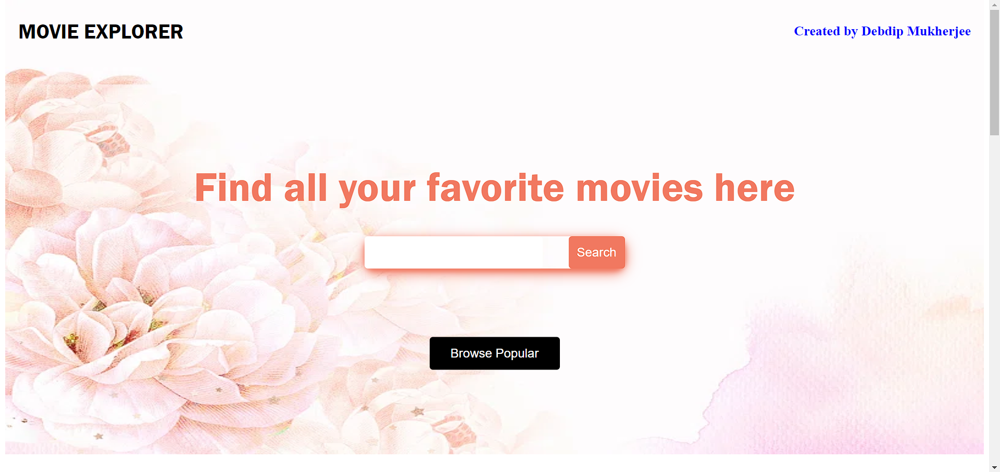
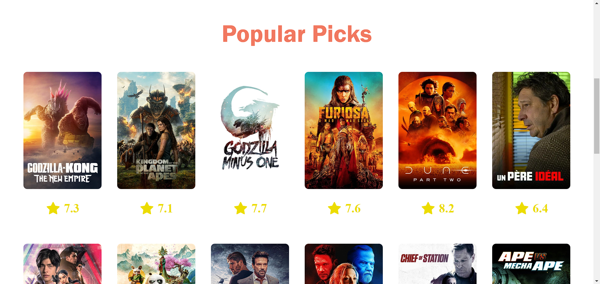
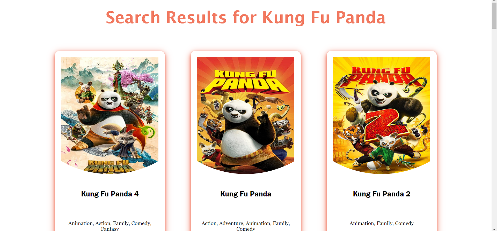

# Movie Explorer

Movie Explorer is your one-stop destination for exploring movies by title. Our web application simplifies movie discovery by focusing on efficient title searches. Powered by The Movie Database (TMDB) API, Movie Explorer fetches detailed movie information, including plot summaries and release dates. Start exploring movies effortlessly with Movie Explorer and uncover the perfect film for every occasion.


## Tech Stack

**Client:** React, React-Router, CSS

**Server:** Node, Express


## Demo

https://movie-explorer-in21.vercel.app/


## Environment Variables

To run this project, you will need to add the following environment variables to your .env file

`AUTHORIZATION_TOKEN` from https://developer.themoviedb.org/docs/getting-started


## Installation

Install movie-explorer with npm

```bash
  git clone https://github.com/DebdipWritesCode/MovieExplorer.git
```

Frontend

```bash
  cd Frontend
  npm install
  npm run dev
```
Backend

```bash
  cd Backend
  npm install
  cd api
  node index.js
```

    
## Screenshots





